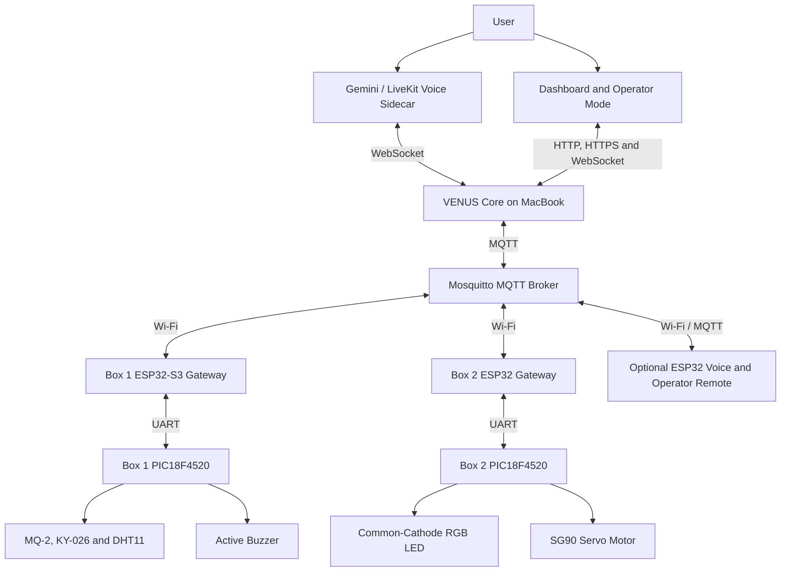

# VENUS — Voice-Enabled Networked Unified System

VENUS is a living-room cyber-physical systems prototype that combines voice interaction, environmental monitoring, deterministic local control, and coordinated actuator response. A laptop hosts the VENUS Core runtime, Mosquitto MQTT broker, Gemini/LiveKit voice sidecar, and dashboard services. Two embedded hardware boxes communicate with the Core over Wi-Fi and MQTT.

> **Academic prototype:** VENUS is not a certified fire, gas, security, or life-safety system.

## Project Overview

VENUS demonstrates how local embedded control can work together with higher-level AI-assisted interaction. The system can:

- Monitor temperature, humidity, gas, and flame conditions.
- Report live sensor and actuator state through a Digital Twin.
- Accept validated voice and operator commands.
- Control a buzzer, RGB LED, and servo motor.
- Execute a local emergency buzzer reflex without relying on the network or AI.
- Coordinate safety actions between separate physical nodes.
- Track command delivery, acknowledgement, timeout, and failure events.
- Distinguish genuine hazards from explicitly labelled operator safety drills.

> The PIC knows how to control the hardware, the ESP32 knows how to communicate, and VENUS knows why and when the system should coordinate across nodes.

## System Architecture



### Responsibility Distribution

- **PIC18F4520:** Direct sensor acquisition, actuator timing, PWM generation, and deterministic local behaviour.
- **ESP32:** Wi-Fi connection, MQTT communication, JSON telemetry, command forwarding, and acknowledgement forwarding.
- **VENUS Core:** Digital Twin management, command validation, MQTT coordination, safety monitoring, and cross-node response.
- **Voice sidecar:** Converts speech into approved tool calls and reports hardware-confirmed results. It does not directly control GPIO pins.
- **MQTT broker:** Carries telemetry, commands, acknowledgements, and interface status between the MacBook and ESP32 nodes.

## Physical Hardware

### Box 1 — Sensor and Safety Node

Box 1 contains:

- ESP32-WROOM-32 Gateway
- PIC18F4520 controller.
- MQ-2 gas sensor.
- KY-026 flame sensor.
- DHT11 temperature and humidity sensor.
- Active buzzer.
- Logic-level converter.
- USB-C power breakout board.

The PIC continuously monitors the sensors and owns the immediate local buzzer reflex. Therefore, hazard detection can activate the buzzer even when VENUS Core, MQTT, or Wi-Fi is unavailable. The ESP32 publishes Box 1 telemetry and forwards manual buzzer commands between VENUS Core and the PIC.

### Box 2 — Actuator Node

Box 2 contains:

- ESP32 DevKit V1 Gateway
- PIC18F4520 controller.
- RGB LED.
- SG90 servo motor.
- Logic-level converter.
- USB-C power breakout board.

The RGB LED supports the following demonstration modes:

- Warm White, approximately 2700 K.
- Natural White, approximately 3500 K.
- Daylight, approximately 5000 K.
- Off.

The SG90 servo represents the door mechanism. A closed state corresponds to 0 degrees and an open state corresponds to 90 degrees.

### Optional Voice and Operator Remote

The optional ESP32-S3 remote provides:

- A dedicated microphone mute button.
- Menu navigation using physical buttons.
- Two OLED displays.
- Fire and gas safety-drill controls.
- A communication-latency test.

Safety drills are explicitly labelled as simulated events. They enter the normal command gateway and may exercise configured actuators, but they remain distinguishable from genuine sensor hazards.

## Software Architecture

The Core is divided into modules with distinct responsibilities:

- `main.py` — Creates the shared services and starts the VENUS runtime.
- `CORE/MQTT_transceiver.py` — Maintains the MQTT connection and processes telemetry, commands, and acknowledgements.
- `CORE/digital_twin.py` — Maintains the logical state of registered sensor and actuator nodes.
- `CORE/command_gateway.py` — Validates actuator requests before delivery.
- `CORE/command_protocol.py` — Tracks command identifiers, acknowledgements, and timeouts.
- `CORE/mqtt_command_protocol.py` — Converts accepted actions into MQTT command messages.
- `CORE/event_bus.py` — Distributes runtime events between Core services.
- `CORE/safety_watchdog.py` — Detects safety conditions from trusted physical telemetry.
- `CORE/safety_response.py` — Converts safety events into coordinated actuator requests.
- `CORE/monitoring_state.py` — Builds monitoring, connectivity, activity, and safety views.
- `CORE/api_server.py` — Provides the WebSocket interface used by the voice sidecar.
- `CORE/sidecar.py` — Runs the Gemini/LiveKit conversational voice interface.
- `CORE/operator_auth.py` — Manages Operator Mode passwords, passkeys, and sessions.
- `CORE/operator_remote.py` — Processes the optional physical remote, drills, and latency measurements.
- `CORE/Venus/` — Contains the VENUS agent, persona, system context, prompt builder, tool schema, and tool policy.

## Repository Structure

```text
VENUS_REPO/
├── CORE/
│   ├── Venus/
│   ├── MQTT_transceiver.py
│   ├── api_server.py
│   ├── command_gateway.py
│   ├── command_protocol.py
│   ├── dashboard_server.py
│   ├── digital_twin.py
│   ├── event_bus.py
│   ├── monitoring_state.py
│   ├── mqtt_command_protocol.py
│   ├── operator_auth.py
│   ├── operator_remote.py
│   ├── safety_event.py
│   ├── safety_response.py
│   ├── safety_voice.py
│   ├── safety_watchdog.py
│   ├── sidecar.py
│   ├── sidecar_client.py
│   └── voice_control.py
├── FIRMWARE/
│   ├── ESP32_BOX1.cpp
│   ├── ESP32_BOX2.cpp
│   ├── ESP32_VOICE_REMOTE.cpp
│   ├── PIC_box1.c
│   └── PIC_BOX2.c
├── DASHBOARD/
│   ├── frontend/
│   ├── app.css
│   ├── app.js
│   ├── index.html
├── main.py
├── requirements.txt
└── README.md
```

## Communication Protocols

```text
Voice sidecar       <-> VENUS Core           WebSocket
Dashboard           <-> VENUS Core           HTTP/HTTPS and WebSocket
VENUS Core          <-> Mosquitto            MQTT over TCP/IP
Mosquitto           <-> ESP32 gateways       MQTT over Wi-Fi
ESP32 gateway       <-> PIC18F4520            UART, 9600 baud, 8N1
PIC18F4520          <-> Physical hardware     GPIO, ADC, PWM, and timers
```

The principal Unified Namespace paths are:

```text
venus/living_room/sensor_node_01/telemetry
venus/living_room/sensor_node_01/status
venus/living_room/actuator_node_01/telemetry
venus/living_room/actuator_node_01/command
venus/living_room/actuator_node_01/ack
venus/living_room/actuator_node_01/status
```

The optional remote uses topics under:

```text
venus/interface/voice_remote_01/
venus/interface/operator_remote_01/
```

## Prerequisites

### Core Runtime

- System that capable to running Python and Mosquitto.
- Python 3.
- Mosquitto MQTT broker.
- A microphone for the voice interface.
- Valid Gemini credentials for the text and real-time voice services.

### Firmware Development

- Arduino IDE or PlatformIO for ESP32 firmware.
- ESP32 board support package.
- Arduino `PubSubClient` library.
- ArduinoJson library.
- Adafruit GFX and Adafruit SSD1306 libraries for the optional remote.
- MPLAB X IDE and the XC8 compiler for PIC18F4520 firmware.

## Installation

Clone the repository and enter its root directory:

```bash
git clone <YOUR_GITHUB_REPOSITORY_URL>
cd VENUS_REPO
```

Create and activate a Python virtual environment:

```bash
python3 -m venv .venv
source .venv/bin/activate
```

Install the Python dependencies:

```bash
pip install -r requirements.txt
```

Install Mosquitto on macOS with Homebrew if it is not already installed:

```bash
brew install mosquitto
```

## Environment Configuration

VENUS loads private runtime settings from `.env.local` in the repository root. This file is intentionally excluded from version control because it contains API credentials and network-specific values.

Create the file beside `main.py`:

```bash
touch .env.local
```

Add the following variables:

```dotenv
GEMINI_API_KEY=
GOOGLE_API_KEY=
VENUS_CORE_WS=ws://127.0.0.1:8000
MQTT_BROKER_IP=127.0.0.1
```

Configure each value as follows:

- `GEMINI_API_KEY` is used by the VENUS Core text-based Gemini agent.
- `GOOGLE_API_KEY` is used by the Gemini real-time voice sidecar.
- `VENUS_CORE_WS` is the WebSocket endpoint through which the voice sidecar communicates with VENUS Core.
- `MQTT_BROKER_IP` is the address of the machine running Mosquitto.

When VENUS Core, the sidecar, and Mosquitto all run on the same laptop, retain:

```dotenv
VENUS_CORE_WS=ws://127.0.0.1:8000
MQTT_BROKER_IP=127.0.0.1
```

If a service runs on another machine, replace `127.0.0.1` with that machine's reachable LAN or Tailscale IP address. Use `wss://` instead of `ws://` only when the WebSocket endpoint has been configured with TLS.

Do not place spaces around the equals sign. Run the Python commands from the repository root so that `.env.local` can be located correctly.

## Firmware Configuration

Before uploading the ESP32 firmware, replace the placeholder network values near the beginning of each applicable `.cpp` file:

```cpp
const char* WIFI_SSID = "WIFI Name";
const char* WIFI_PASSWORD = "WIFI Password";
const char* MQTT_BROKER = "MQTT IP";
```

Use the IP address of the laptop or other machine running Mosquitto. The ESP32 cannot use `127.0.0.1` to reach a broker on the laptop because, from the ESP32's perspective, `127.0.0.1` refers to the ESP32 itself.

Upload the corresponding firmware to each device:

- `FRIMWARE/ESP32_BOX1.cpp` — Box 1 ESP32-WROOM-32 gateway.
- `FRIMWARE/PIC_box1.c` — Box 1 PIC18F4520 controller.
- `FRIMWARE/ESP32_BOX2.cpp` — Box 2 ESP32 DevKit V1 gateway.
- `FRIMWARE/PIC_BOX2.c` — Box 2 PIC18F4520 controller.
- `FRIMWARE/ESP32_VOICE_REMOTE.cpp` — Optional ESP32 voice and operator remote.

After uploading, open the ESP32 serial monitor at 115200 baud and confirm that Wi-Fi and MQTT connect successfully.

## Running VENUS

Start or restart Mosquitto:

```bash
brew services restart mosquitto
```

Activate the virtual environment and start VENUS Core from the repository root:

```bash
source .venv/bin/activate
python3 main.py
```

Open a second terminal, return to the repository root, and start the voice sidecar in console mode:

```bash
source .venv/bin/activate
python3 -m CORE.sidecar console
```

When the services and hardware nodes are ready, verify that:

- VENUS Core reports a successful MQTT connection.
- Box 1 and Box 2 report Wi-Fi and MQTT connectivity through their serial monitors.
- Sensor and actuator telemetry appears in the Core terminal.
- The voice sidecar reports that its connection to VENUS Core is established.
- Commands are reported as successful only after a matching hardware acknowledgement is received.

## Emergency Behaviour

### Genuine Hazard

When Box 1 detects gas or flame:

1. The Box 1 PIC activates the buzzer immediately as a local reflex.
2. The Box 1 ESP32 publishes the physical telemetry through MQTT.
3. The VENUS safety watchdog generates a trusted safety event.
4. The safety-response handler requests the cross-node response through the command gateway.
5. Box 2 opens the servo to its emergency position.
6. VENUS tracks the hardware acknowledgement and reports the confirmed outcome.

Clearing the hazard re-arms the watchdog, but the current safety policy does not automatically close the servo.

### Operator Safety Drill

The optional hardware remote can generate explicitly labelled fire or gas drills. A trusted drill may activate the buzzer and servo through the normal command path. When the drill ends, VENUS restores their previous states unless a genuine hazard or another drill remains active.

## Supported User Operations

VENUS can provide sensor telemetry and submit validated commands for:

- Buzzer activation and deactivation.
- RGB LED warm-white, natural-white, daylight, and off modes.
- Servo open and close states.
- Microphone mute and unmute control through supported interfaces.
- Fire and gas safety drills through the registered operator remote.
- Remote-to-Core MQTT latency measurement.

All remote actuator requests pass through VENUS Core. The voice sidecar and dashboard do not directly manipulate hardware pins.

## Current Limitations

- Device identities, capabilities, MQTT topics, and safety responses are currently defined explicitly in the source code.
- Adding a new device may require coordinated changes to firmware, Core tools, the Digital Twin, safety policies, and monitoring interfaces.
- The PIC18F4520 requires an ESP32 gateway for wireless and MQTT communication.

## Future Improvements

Potential future development includes:

- Consolidating suitable nodes onto a single ESP32-class microcontroller while preserving high-priority local safety behaviour.
- Introducing metadata-driven device abstraction and dynamic capability registration.
- Evaluating compatibility with the emerging Model Hardware Standard when its public specification becomes available and sufficiently mature.
- Providing stronger device identity, authentication, and encrypted communication.
- Supporting modern smart-home technologies such as Matter and Thread.
- Adding persistent telemetry and event storage.
- Expanding automated tests, diagnostics, and device lifecycle management.


## Author and Academic Information

- **Author:** Oo Yong Da, Chow Win Sean, Poon Chun Yuh, Chew Wei Shern, Goh Pui Ling
- **Course or module:** UEEA 2634
- **Institution:** University Tunku Abdul Rahman
- **Academic year:** Year 2 Sem 3
